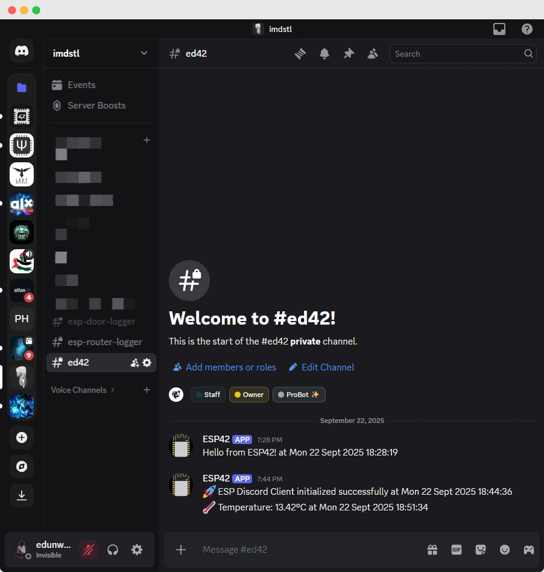

<h1 align="center">
 ESP Discord Client Library
</h1>

 <br>
 
 

An Arduino library for ESP8266 and ESP32 microcontrollers to send messages to Discord using webhooks with automatic timestamps.

<p align="center">
  <a href="https://www.arduino.cc/en/Reference/Libraries"></a>
  <a href="https://github.com/esp8266/Arduino"></a>
  <a href="https://github.com/espressif/arduino-esp32"></a>

  
  
  
  
  
  
</p>

## 📸 Preview

See the ESP Discord Client in action:



## 📋 Features

- ✨ **Cross-Platform**: Works on both ESP8266 and ESP32
- 📡 **WiFi Management**: Automatic WiFi connection handling
- 🔔 **Discord Integration**: Send messages via Discord webhooks
- ⏰ **Timestamps**: Automatic timestamp generation with timezone support
- 🔒 **Secure**: HTTPS communication with Discord
- 🎨 **Custom Branding**: Messages appear with ESP logo avatar and custom username
- 📝 **Simple API**: Easy to use with minimal setup
- 🛠️ **Lightweight**: Minimal memory footprint

## 🚀 Installation

### Arduino Library Manager (Recommended)

1. Open Arduino IDE
2. Go to **Sketch** → **Include Library** → **Manage Libraries**
3. Search for "ESP Discord Client"
4. Click **Install**

### Manual Installation

1. Download this repository as ZIP
2. Extract to your Arduino libraries folder:
   - **Windows**: `Documents/Arduino/libraries/`
   - **macOS**: `Documents/Arduino/libraries/`
   - **Linux**: `~/Arduino/libraries/`
3. Restart Arduino IDE

## 🧩 Dependencies

This library requires:

- **NTPClient** (install via Library Manager)

## ⚡ Quick Start

```cpp
#include <ESPDiscordClient.h>
#include "Config.hpp" // Contains your WiFi credentials and timezone

// Create Discord client instance with timezone support
DiscordClient discord(SECRET_SSID, SECRET_PASS, SECRET_WEBHOOK, TIME_ZONE);

void setup() {
  Serial.begin(9600);

  // Connect to WiFi
  discord.connectWiFi();

  // Send message with automatic timestamp
  discord.sendMessage("Hello from ESP42!");
}

void loop() {
  // Your code here
}
```

## 🛠 Hardware Requirements

**Compatible Boards:**

- **ESP8266**: NodeMCU, Wemos D1 Mini, ESP-01, etc.
- **ESP32**: ESP32 DevKit, ESP32-WROOM, ESP32-S2, ESP32-C3, etc.

**Additional Requirements:**

- USB cable for programming
- Stable 2.4GHz WiFi connection (both platforms support 2.4GHz only)

## 📚 Software Requirements

- **Arduino IDE** with board support for your chosen platform:
  - ESP8266 board support (for ESP8266 boards)
  - ESP32 board support (for ESP32 boards)

**Required Libraries:**

- `NTPClient` by Fabrice Weinberg (install via Library Manager)

**Platform-Specific Libraries (Auto-included):**

**For ESP8266:**

- `ESP8266WiFi`
- `ESP8266HTTPClient`
- `WiFiClientSecure`

**For ESP32:**

- `WiFi`
- `HTTPClient`
- `WiFiClientSecure`

> 💡 **Note**: The code automatically includes the correct libraries based on your selected board!

## 🚀 Setup

### 1. Install Board Support

#### For ESP8266:

1. Open Arduino IDE
2. Go to File → Preferences
3. Add this URL to "Additional Board Manager URLs":
   ```url
   http://arduino.esp8266.com/stable/package_esp8266com_index.json
   ```
4. Go to Tools → Board → Boards Manager
5. Search for "ESP8266" and install the package

#### For ESP32:

1. Open Arduino IDE
2. Go to File → Preferences
3. Add this URL to "Additional Board Manager URLs":
   ```url
   https://dl.espressif.com/dl/package_esp32_index.json
   ```
4. Go to Tools → Board → Boards Manager
5. Search for "ESP32" and install the package by Espressif Systems

> 💡 **Tip**: You can add both URLs separated by commas to support both platforms!

### 2. Install Required Libraries

1. Go to Sketch → Include Library → Manage Libraries
2. Search and install:
   - `NTPClient` by Fabrice Weinberg

### 3. Create Discord Webhook

1. Go to your Discord server
2. Right-click on the channel where you want to receive messages
3. Select "Edit Channel" → "Integrations" → "Webhooks"
4. Click "New Webhook"
5. Copy the webhook URL

## ⚙️ Configuration

### Update Configuration

Edit `Config.hpp` with your information:

```cpp
#define SECRET_SSID "Your_WiFi_Name"
#define SECRET_PASS "Your_WiFi_Password"
#define SECRET_WEBHOOK "https://discord.com/api/webhooks/YOUR_WEBHOOK_URL"
#define TIME_ZONE 0 // Your timezone offset in hours (e.g., 1 for GMT+1, -5 for EST)
```

**⚠️ Security Note**: Never commit real credentials to version control. Consider using environment variables or a separate config file for production.

### Timezone Configuration

Set your timezone in `Config.hpp` using hours offset from UTC:

```cpp
#define TIME_ZONE 1 // GMT+1 (1 hour ahead of UTC)
```

Common timezone offsets (in hours):

- GMT+0: `0`
- GMT+1: `1`
- GMT+8: `8`
- GMT-5: `-5`

The timezone value is passed to the DiscordClient constructor and automatically converted to seconds internally.

## 💻 Usage

### Platform Detection

The code automatically detects whether you're using ESP8266 or ESP32 and adapts accordingly. When your board boots up, you'll see a message indicating which platform is running:

```
Running on ESP8266
```

or

```
Running on ESP32
```

This is handled automatically through preprocessor directives - no manual configuration needed!

### Basic Example

```cpp
#include <ESPDiscordClient.h>
#include "Config.hpp"

DiscordClient discord(SECRET_SSID, SECRET_PASS, SECRET_WEBHOOK, TIME_ZONE);

void setup() {
  Serial.begin(9600);

  // Connect to WiFi
  discord.connectWiFi();

  // Send a message
  discord.sendMessage("Hello from ESP42!");
}

void loop() {
  // Your main code here
}
```

### Advanced Usage

```cpp
// Send sensor data
float temperature = 25.6;
String message = "Temperature: " + String(temperature) + "°C";
discord.sendMessage(message);

// Send alerts
if (temperature > 30) {
  discord.sendMessage("⚠️ High temperature alert!");
}
```

### 🎨 Webhook Customization

The library automatically sends messages with:

- **Custom Username**: "ESP Discord Client"
- **ESP Logo Avatar**: Uses the ESP logo from the project as the webhook avatar
- **Branded Appearance**: Messages appear with consistent ESP branding in Discord

This gives your ESP device messages a professional, recognizable appearance in Discord channels.

## ⚙️ Technical Implementation

### Cross-Platform Compatibility

This project uses preprocessor directives to automatically include the correct libraries and handle platform differences:

```cpp
#if defined(ESP8266)
#include <ESP8266WiFi.h>
#include <ESP8266HTTPClient.h>
#elif defined(ESP32)
#include <WiFi.h>
#include <HTTPClient.h>
#endif
```

**Key Benefits:**

- **Single Codebase**: One project works on both platforms
- **Automatic Detection**: No manual configuration required
- **Platform-Specific Optimizations**: Uses the best libraries for each platform
- **Future-Proof**: Easy to add support for new ESP variants

### Library Mapping

| Feature         | ESP8266 Library     | ESP32 Library      |
| --------------- | ------------------- | ------------------ |
| WiFi Management | `ESP8266WiFi`       | `WiFi`             |
| HTTP Client     | `ESP8266HTTPClient` | `HTTPClient`       |
| Secure Client   | `WiFiClientSecure`  | `WiFiClientSecure` |
| NTP Time        | `NTPClient`         | `NTPClient`        |

## 📖 API Reference

### DiscordClient Class

#### Constructor

```cpp
DiscordClient(const char *ssid, const char *password, const char *webhookUrl, int timezone = 0)
```

- `ssid`: WiFi network name
- `password`: WiFi network password
- `webhookUrl`: Discord webhook URL
- `timezone`: Timezone offset in hours from UTC (optional, defaults to 0)

#### Methods

**`void connectWiFi()`**

- Connects to the specified WiFi network
- Blocks until connection is established
- Prints connection status to Serial

**`bool sendMessage(const String &content)`**

- Sends a message to Discord
- Automatically appends timestamp
- Returns `true` if successful, `false` otherwise

### NetTime Class

**`void begin(int timeOffset = 0)`**

- Initializes NTP client with timezone offset
- Offset in seconds from UTC

**`String getTime()`**

- Returns formatted timestamp string
- Format: "Day, Month Date Year HH:MM:SS"

## 🔧 Troubleshooting

### Common Issues

**WiFi Connection Failed**

- Check SSID and password in `Config.hpp`
- Ensure your ESP board is in range of WiFi
- Verify WiFi network is 2.4GHz (both ESP8266 and ESP32 require 2.4GHz)

**Message Not Sent**

- Verify webhook URL is correct
- Check internet connection
- Monitor Serial output for error codes

**Compilation Errors**

- Ensure all required libraries are installed
- Check correct board (ESP8266/ESP32) is selected in Tools → Board
- Verify correct port is selected
- Ensure you have the right board support package installed

### Debug Output

Enable detailed debugging by monitoring Serial output at 9600 baud:

- WiFi connection status
- HTTP response codes
- Success/failure messages

### HTTP Response Codes

- `200/204`: Success
- `400`: Bad Request (check webhook URL/format)
- `401`: Unauthorized (webhook may be invalid)
- `429`: Rate Limited (too many requests)

## 🤝 Contributing

1. Fork the repository
2. Create a feature branch (`git checkout -b feature/amazing-feature`)
3. Commit your changes (`git commit -m 'Add amazing feature'`)
4. Push to the branch (`git push origin feature/amazing-feature`)
5. Open a Pull Request

## 📄 License

This project is open source and available under the [MIT LICENSE](LICENSE.md).

## 🙏 Acknowledgments

- ESP8266 & ESP32 Communities
- Espressif Systems for the amazing ESP platforms
- Arduino IDE Team
- NTPClient library by Fabrice Weinberg
- Contributors to ESP8266/ESP32 Arduino Core projects

<br>

<h1 align="center">
 Thanks for stopping by and taking a peek at my work!
</h1>
